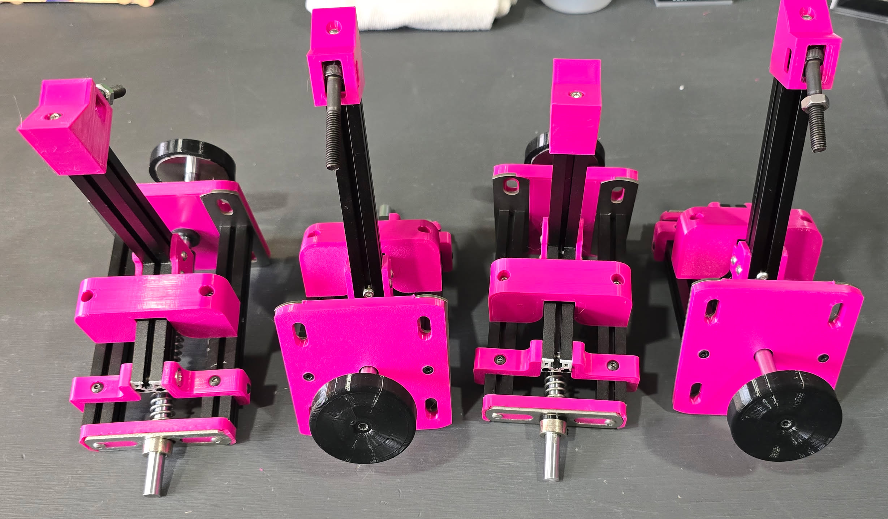
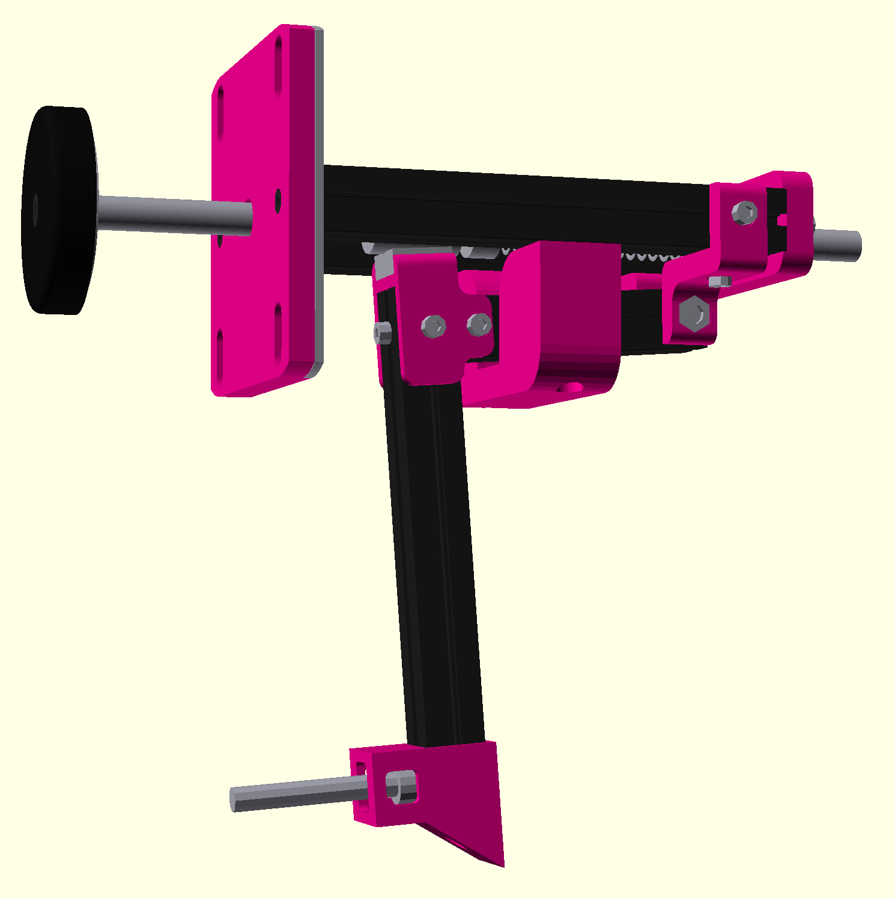
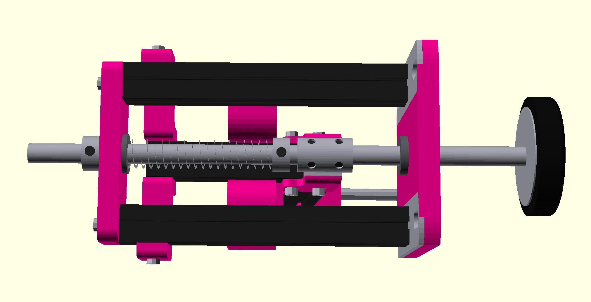
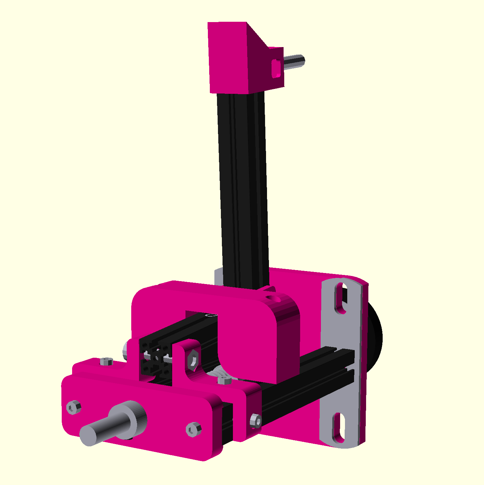

# open-flyball-thruster (OFT)

## Flyball?
If you don't know flyball, you probably don't need to a flyball box thruster. Flyball is a fast paced team dog sport, it's somewhat of a relay race where four dogs race over jumps, trigger a box to retrieve a ball (shot out by a thuster) and race back while then next dog goes.

Common organizations are [NAFA](https://www.nafaflyball.com/) and [U-FLI](https://u-fli.com/) in North America, [BFA](https://www.flyball.org.uk/) and [UKFL](https://www.ukflyball.org.uk/) in the UK, and there are more in other parts of the world.

## Word of Warning
If you're here, you're most likely looking at building your own thruster. My first word of warning is that you shouldn't. Thrusters are pretty intricate and difficult to get right. Building a box from scratch is a huge task, and thrusters, arguably, are even more difficult to build.

- **Not battle-tested.** These thrusters have been used for about a year now, weekly at practice and a half dozen of times at a tournament. They've been working without any issues but we recommend you buy thrusters from established suppliers, for example:
  - **[Jarvis Flyball Box](https://www.flyballbox.ca/)** (Canada)
  - **[Sub 15](https://www.facebook.com/p/Sub-15-61551941167602/)** (UK)

Please let me know if you want your name added (or removed) from the above list.

- **No support or warranty.** All of the files and instructions provided in this repository are provided as is and with no support or warranty. I am not responsible for any accident, injuries or whatever happens while building or using these.

- **Spare parts.** I would definitely recommend you keep spare parts on hand, and ideally a complete spare thruster, so you can quickly replace failed components.

- **AI-assisted SCAD.** [Cursor](https://cursor.com/) was used to help write and edit the OpenSCAD; the design may contain errors or need iteration.

## Introduction

An **open-source**, **low-cost** [flyball](https://en.wikipedia.org/wiki/Flyball) thruster design aimed at DIY builders. Thrusters are built from a mix of **printed parts** and **off-the-shelf hardware**, with some basic machining required. Printed parts are defined in [OpenSCAD](https://openscad.org/), with some customization available.

The target cost is, currently, approximately **$30 USD** per thruster, excluding tools and printer access.

## Instructions
This project is for **DIY-ers only**. You should have:

- **Basic metal-cutting tools** (e.g. saw, drill, tap and dies, etc) to machine some of the metal parts.
- **Access to a 3D printer** (your own or a maker space) for printing the OpenSCAD-generated parts.

Familiarity with OpenSCAD is helpful if you want to tweak dimensions or part geometry.

* Obtain the all parts, see [docs/bom.md](docs/bom.md)
* Assemble the thruster, see [docs/assembly.md](docs/assembly.md)
* Tune as necessary, see [docs/tuning.md](docs/tuning.md)

A more detailed instructions guide can be found under [docs/instructions.md](docs/instructions.md).

### Assembly Timelapse
https://github.com/user-attachments/assets/54a8cb0c-5971-4721-8ede-dae078966e4b

## Design

This is a fairly standard flyball thruster. A **main spring** on a **linear rod** drives the ball; a **shaft coupler** gives the rod two positions (rest and loaded). A **hammer/striker** holds the rod in the secondary (loaded) position via a small spring.

**To load:** Push back on the **plunger**. The thruster stays in the loaded position: the hammer head bears against the rod and keeps it in the secondary position.

**To fire:** Something must push back or down on the hammer to release the rod, typically a **bolt** between the box’s pedal and the hammer. The optional **pedal connector** is a printed part that sits between the pedal and the hammer to carry that screw.

|  |  |  |
|:---------:|:--------:|:-----------:|
| Side view | Top view | Bottom view |

## Contributions
Feel free to submit a pull request or start a discussion if you want to dicuss something, but again, I do not provide support for these.

## License
All files are licensed as CC BY-NC-SA 4.0.

See [LICENSE](LICENSE) for the full legal text.

These designs are free to use, modify, and manufacture for personal and non-commercial club use. Commercial manufacture, sale, or commercial distribution is not permitted without permission from the author.
