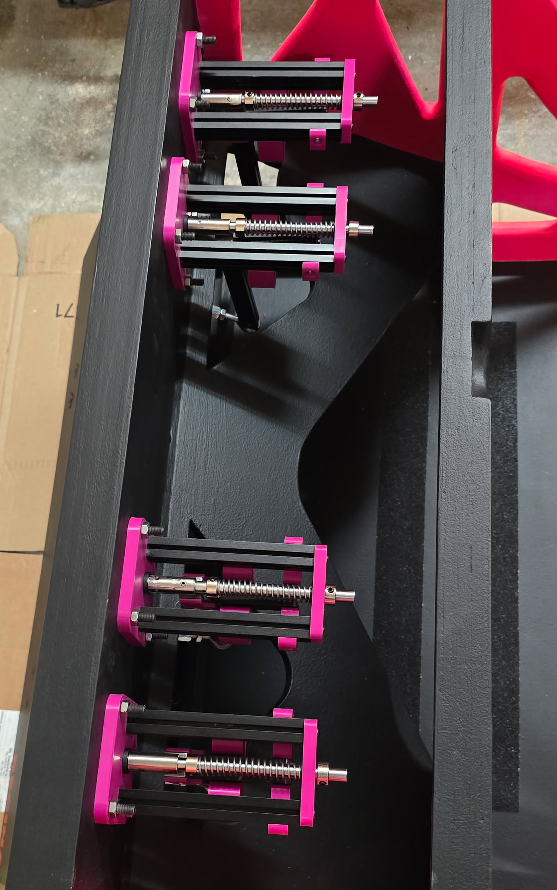

# open-flyball-thruster (OFT)

## Introduction
An **open-source**, **low-cost** [flyball](https://en.wikipedia.org/wiki/Flyball) thruster design aimed at DIY builders. This repository covers the **thrusters only**; it does not include any instructions for building a flyball box.

Thrusters are built from a mix of **printed parts** and **off-the-shelf hardware**, with some basic machining required. Printed parts are defined in [OpenSCAD](https://openscad.org/), with some customization available.

The target cost is, currently, approximately **$35 USD** per thruster, excluding tools and printer access.

### A Note About 3D Printed Parts
I'm sure some people will say something along the lines of "using 3D printed parts for something like this is not a good idea". This was engineered in a way where most of the tension and stress will be distributed on metal fasteners and baffles. The important bits are mostly all metal. The printed parts are mostly there to support fasteners or metal parts. Some tension/stress will happen on the printed parts, so you should fully expect some parts to break at some point.

|  |  |
|:---------:|:--------:|
| Side view | 4 thrusters mounted in a box |

## Flyball?
If you don't know flyball, you probably don't need to a flyball box thruster. Flyball is a fast paced team dog sport, it's somewhat of a relay race where four dogs race over jumps, trigger a box to retrieve a ball (shot out by a thruster) and race back while then next dog goes.

Common organizations are [NAFA](https://www.nafaflyball.com/) and [U-FLI](https://u-fli.com/) in North America, [BFA](https://www.flyball.org.uk/) and [UKFL](https://www.ukflyball.org.uk/) in the UK, and there are more in other parts of the world.

## Word of Warning
If you're here, you're most likely looking at building your own thruster. My first word of warning is that you probably shouldn't. You're better off buying thrusters from established suppliers, for example:
  - **[Jarvis Flyball Box](https://www.flyballbox.ca/)** (Canada)
  - **[Sub 15](https://www.facebook.com/p/Sub-15-61551941167602/)** (UK)
  - Please let me know if you want your name added (or removed) from the above list.

These thrusters are:
- **Not battle-tested.** As of this writing, they haven't been used for more than a year. We've used them weekly at practice and a half dozen of times at various tournaments. They've been working without much issues for us and the last iteration has been pretty solid.

- **Many small parts.** Since these combine 3D printed parts and metal parts instead of custom machined parts, they contain many more small parts than a machined thruster would, making them more susceptible to breaking.

- **No support or warranty.** All of the files and instructions provided in this repository are provided as is and with no support or warranty. I am not responsible for any accident, injuries or whatever happens while building or using these.

- **Spare parts.** I would definitely recommend you keep spare parts on hand, and ideally a complete spare thruster, so you can quickly replace failed components.

- **AI-assisted SCAD.** The original design was completely done in Fusion 360, but at some point I stopped using Fusion and switched to OpenSCAD. [Cursor](https://cursor.com/) was used to help re-write the parts in OpenSCAD; they may contain errors, need iteration or might be sub-optimal.

## Instructions
This project is for **DIY-ers only**. You should have:

- **Basic metal-cutting tools** (e.g. saw, drill, tap and dies, etc) to machine some of the metal parts.
- **Access to a 3D printer** (your own or a maker space) for printing the OpenSCAD-generated parts.

Familiarity with OpenSCAD is helpful if you want to tweak dimensions or part geometry.

Acquire [parts (bom.md)](docs/bom.md) and follow [instructions.md](docs/instructions.md) to get started.

TL;DR:
* Obtain the all parts, see [docs/bom.md](docs/bom.md)
* Get the parts prepared, see [docs/instructions.md](docs/instructions.md)
* Assemble the thruster, see [docs/assembly.md](docs/assembly.md)
* Tune as necessary, see [docs/tuning.md](docs/tuning.md)

### Assembly Timelapse
https://github.com/user-attachments/assets/54a8cb0c-5971-4721-8ede-dae078966e4b

## Design

This is a fairly standard flyball thruster. A **main spring** on a **linear rod** drives the ball; a **shaft coupler** gives the rod two positions (rest and loaded). A **hammer/striker** holds the rod in the secondary (loaded) position via a small spring.

**To load:** Push back on the **plunger**. The thruster stays in the loaded position. The hammer head bears against the rod and keeps it in the secondary position.

**To fire:** Something must push back or down on the hammer to release the rod, typically a **bolt** between the box’s pedal and the hammer. The optional **pedal connector** is a printed part that sits between the pedal and the hammer to carry that screw.

|  |  |  |
|:---------:|:--------:|:-----------:|
| Side view | Top view | Bottom view |

## Contributions
Feel free to submit a pull request or start a discussion if you want to discuss something, but again, I do not provide support for these.

## License
All files are licensed as CC BY-NC-SA 4.0.

See [LICENSE](LICENSE) for the full legal text.

These designs are free to use, modify, and manufacture for personal and non-commercial club use. Commercial manufacture, sale, or commercial distribution is not permitted without permission from the author.
