# Assembly

Gather all items from the [Bill of Materials](bom.md) and prepare the printed parts, extrusions, hammer head, and plunger plate as described in [instructions.md](instructions.md). Then assemble in the order below.

- [1. Hammer](#1-hammer)
  - [1.1 Prepare the hammer joint](#11-prepare-the-hammer-joint)
  - [1.2 Fit the hammer side extrusion](#12-fit-the-hammer-side-extrusion)
  - [1.3 Fit the hammer top extrusion](#13-fit-the-hammer-top-extrusion)
  - [1.4 Blind-join the extrusions](#14-blind-join-the-extrusions)
  - [1.5 Attach the hammer head](#15-attach-the-hammer-head)
- [2. Plunger](#2-plunger)
- [3. Main body](#3-main-body)
  - [3.1 Baffles](#31-baffles)
  - [3.2 Extrusions](#32-extrusions)
  - [3.3 Nuts](#33-nuts)
  - [3.4 Backstop](#34-backstop)
- [4. Linear rod](#4-linear-rod)
- [5. Hammer assembly](#5-hammer-assembly)
  - [5.1 Hammer holders](#51-hammer-holders)
  - [5.2 Hammer spring](#52-hammer-spring)
- [6. Pedal connector](#6-pedal-connector-optional)
- [Mounting](#mounting)

## 1. Hammer

| 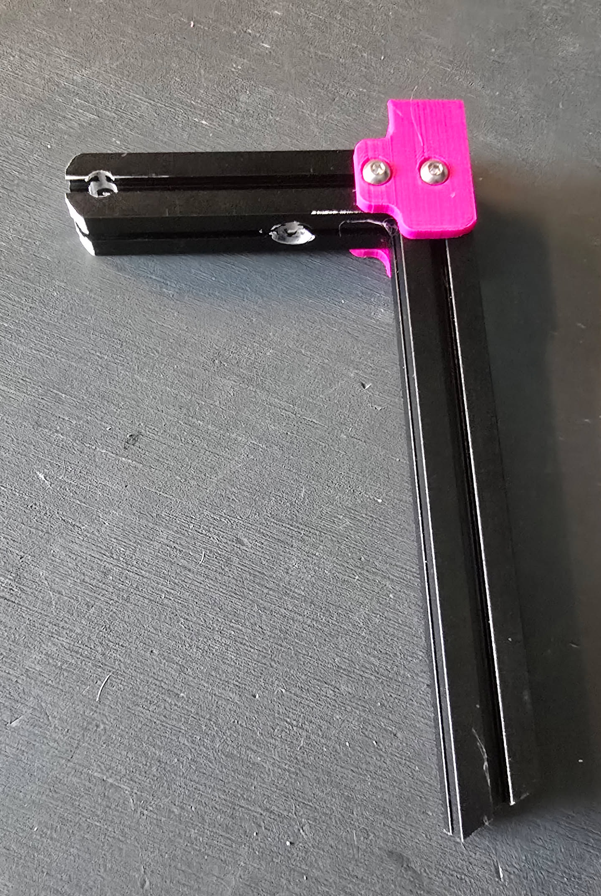 |
|:--:|
| *Completed hammer: side and top extrusions joined at the hammer joint.* |

You will need:

- Hammer joint (`hammer_joint.stl`)
- Hammer side extrusion
- Hammer top extrusion
- Machined hammer head (**M4 × 15 × 15 × 3 mm** square nut)
- **4 × M3 × 6 mm** button head screws
- **4 × M3** square nuts
- **1 × M4 × 14 mm** countersunk Torx screw
- **1 × M3 × 25 mm** socket head cap screw

### 1.1 Prepare the hammer joint

Put the **4 × M3 × 6 mm** button screws through the holes in the hammer joint and **loosely** thread an **M3 square nut** onto each one. Leave them loose enough that the nuts can slide into the extrusion T-slots.

| 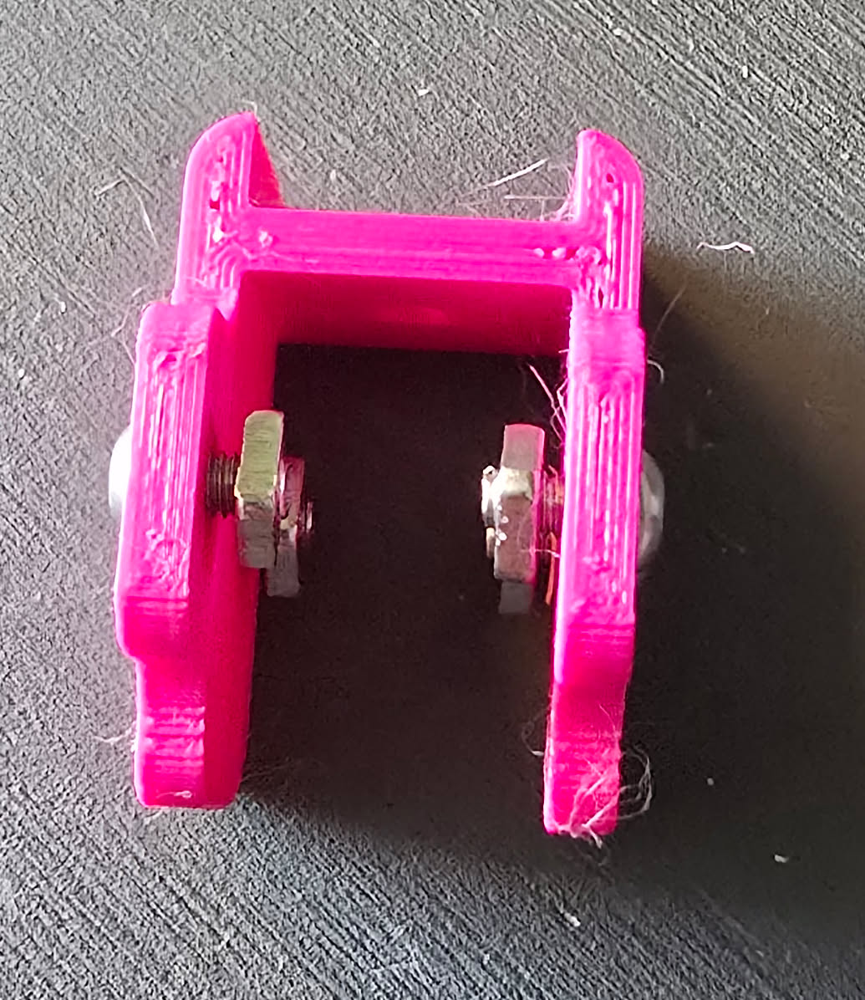 |
|:--:|
| *Hammer joint with M3 × 6 mm button screws and square nuts loosely threaded on.* |

### 1.2 Fit the hammer side extrusion

Slide the hammer joint onto the **top** of the hammer side extrusion (the end with the **3.2 mm** through hole). The square nuts should drop into the extrusion T-slots. Line the joint up so it sits at the top of the extrusion, then tighten the two screws.

| 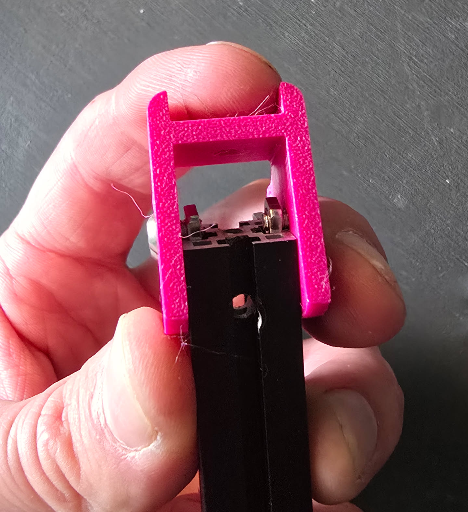 |
|:--:|
| *Hammer joint slid onto the hammer side extrusion, nuts in the T-slots.* |

### 1.3 Fit the hammer top extrusion

Slide the hammer top extrusion into the remaining opening of the hammer joint, **tapped end first** (opposite the 5.5 mm through hole). Line it up with the side extrusion so the two pieces meet at a right angle, then tighten the remaining two screws.

| 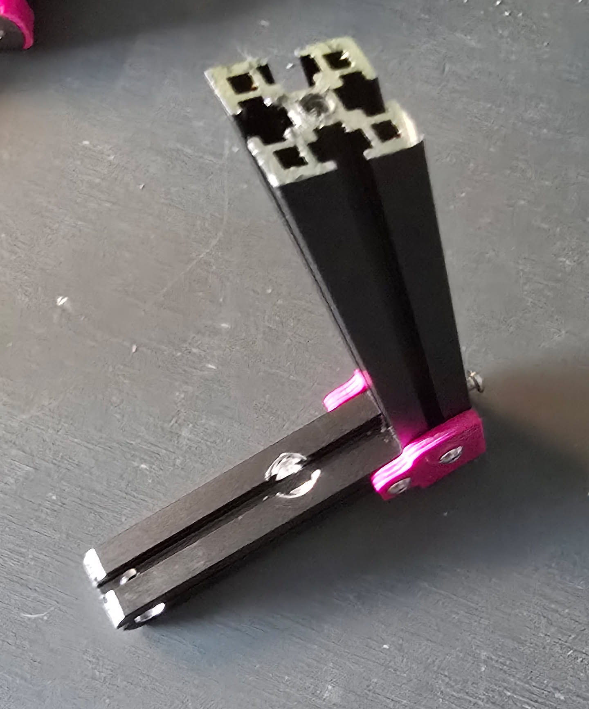 |
|:--:|
| *Hammer top extrusion slid into the joint, forming an L with the side extrusion.* |

### 1.4 Blind-join the extrusions

Join the side extrusion to the top extrusion with the **M3 × 25 mm** socket head cap screw: pass it through the **3.2 mm** hole in the side extrusion and into the **tapped end** of the top extrusion. Tighten it so the two extrusions are pulled together inside the joint.

### 1.5 Attach the hammer head

Seat the machined **M4 × 15 × 15 × 3 mm** square nut in the recess on top of the hammer joint, over the side extrusion. Countersunk side facing out. Fasten it to the **top of the side extrusion** with the **M4 × 14 mm** countersunk Torx screw so the head sits flush.

| 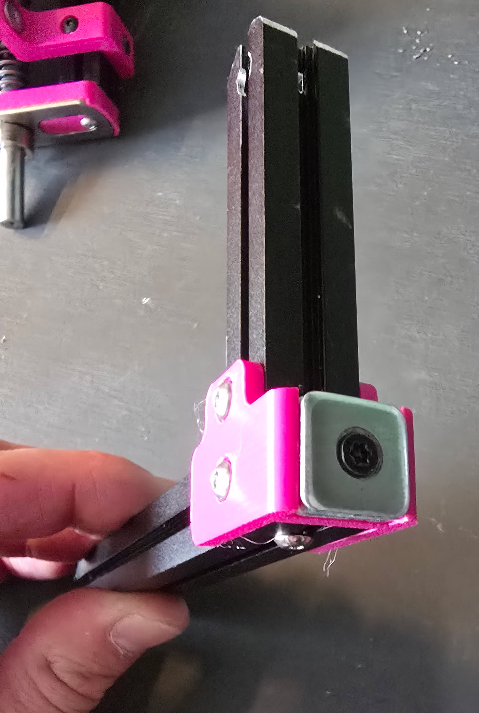 |
|:--:|
| *Hammer head (square nut) fastened to the top of the side extrusion with the M4 × 14 mm countersunk screw.* |

## 2. Plunger

You will need:

- Plunger (`plunger.stl`)
- Machined plunger metal plate
- Linear rod (**8 mm OD × 200 mm**, M4 threaded ends)
- **1 × M4 × 14 mm** countersunk Torx screw

Stick the plunger metal plate to the `plunger.stl` TPU part and pass the **M4 × 14 mm** countersunk Torx screw through the plunger.

| 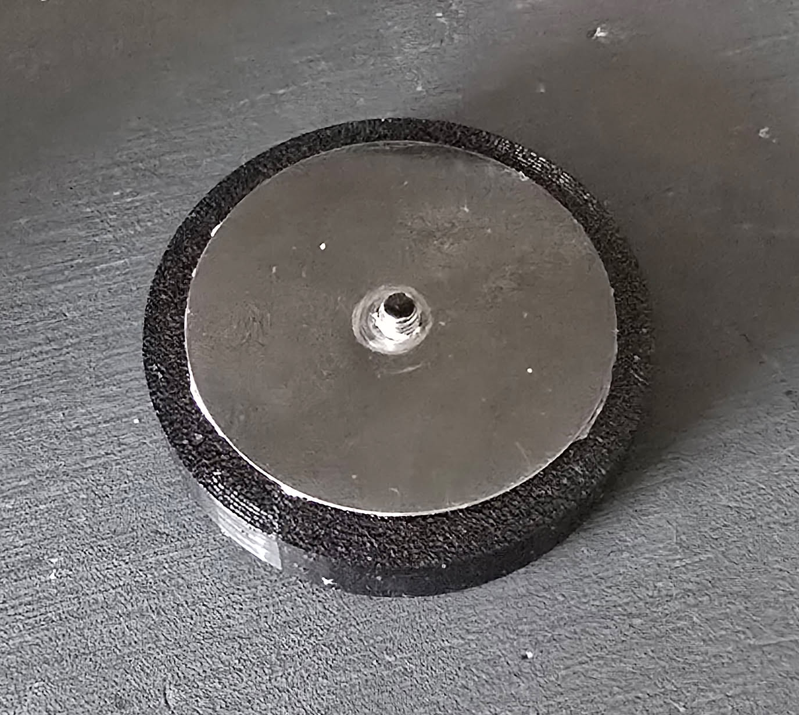 | 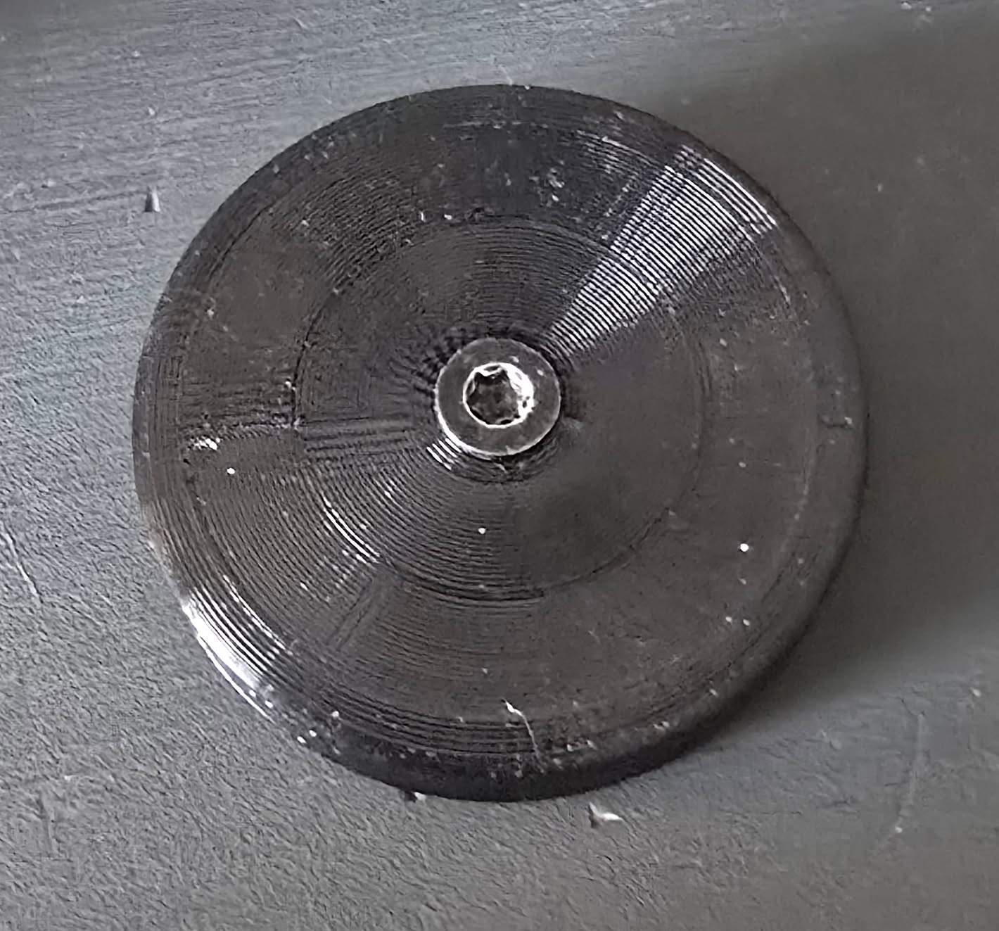 |
|:--:|:--:|
| *Metal plate on the bottom of the plunger, screw passing through.* | *Countersunk screw seated in the top of the TPU plunger.* |

Affix the plunger to the linear rod: screw the **M4 × 14 mm** countersunk Torx screw into one **threaded end** of the linear rod.

## 3. Main body

| 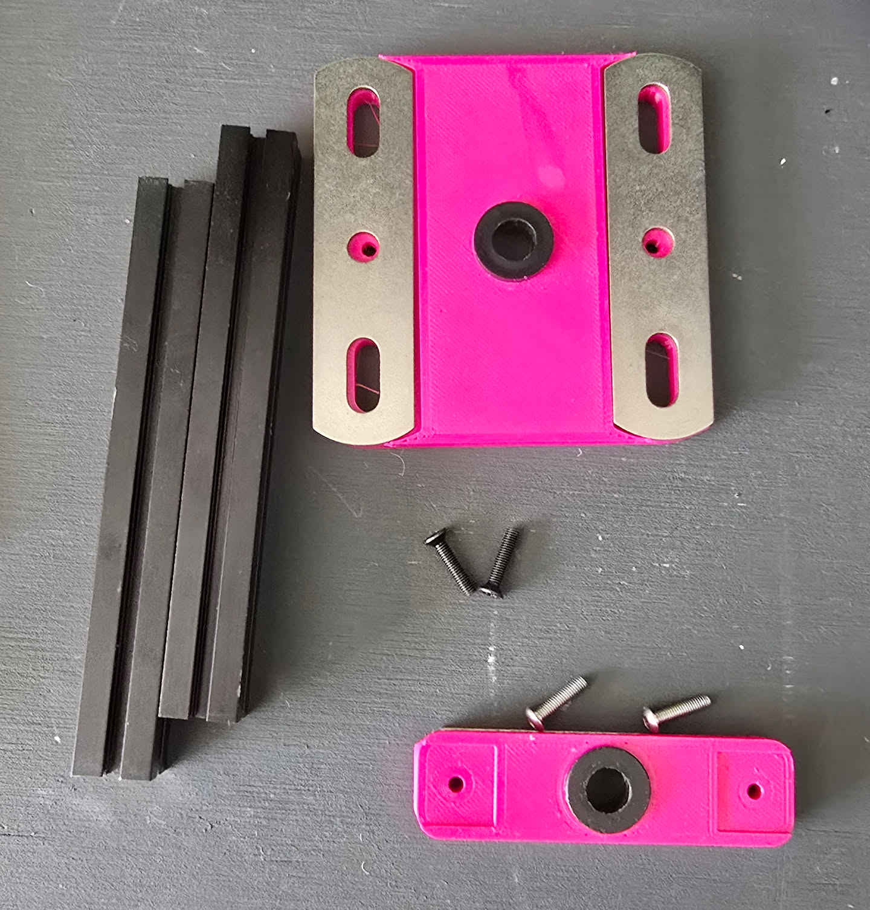 |
|:--:|
| *Parts for the main body: base, backstop, two profile extrusions, and fasteners.* |

You will need:

- Base (`base.stl`) with bushing installed
- Backstop (`backstop.stl`) with bushing installed
- **2 ×** 115 mm profile extrusions
- **2 × 80×20×2 mm** stainless steel baffles
- **6 × M3** square nuts
- **2 × M3 × 12 mm** button head screws
- **2 × M4 × 14 mm** countersunk Torx screws (through the baffles, into the extrusions)

### 3.1 Baffles

Drop the **80×20×2 mm** baffles into the recesses on the base. Pass an **M4 × 14 mm** countersunk Torx screw through the **middle hole** of each baffle; these screws will thread into the extrusions in the next step.

| 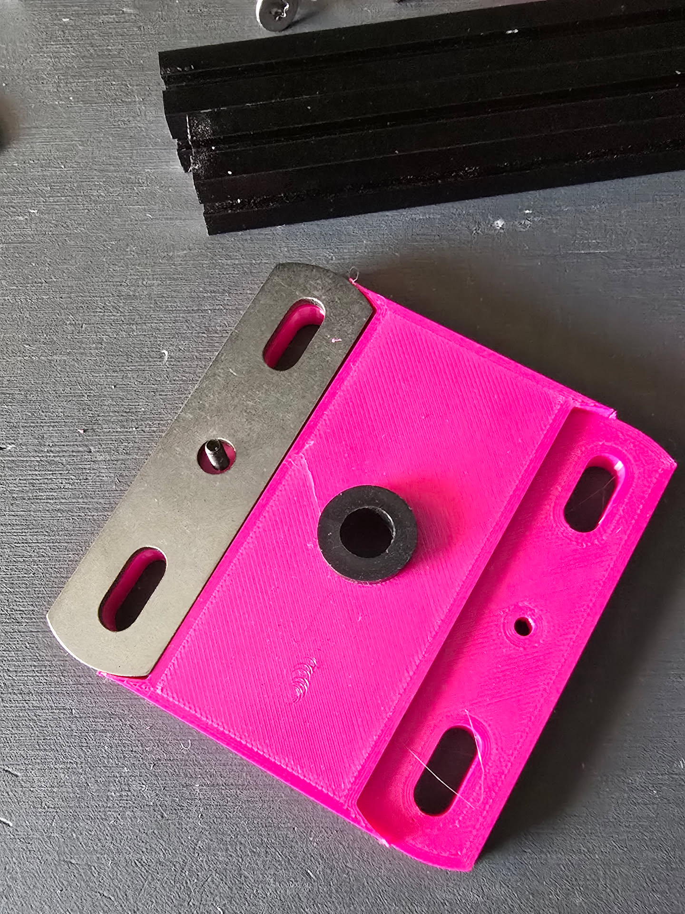 |
|:--:|
| *80×20×2 mm baffle in the base, countersunk screw through the middle hole.* |

### 3.2 Extrusions

Screw the two main side extrusions onto the screws that pass through the baffles. Make sure they are **squared up**, then tighten. You can also just twist each extrusion onto the screw.

| 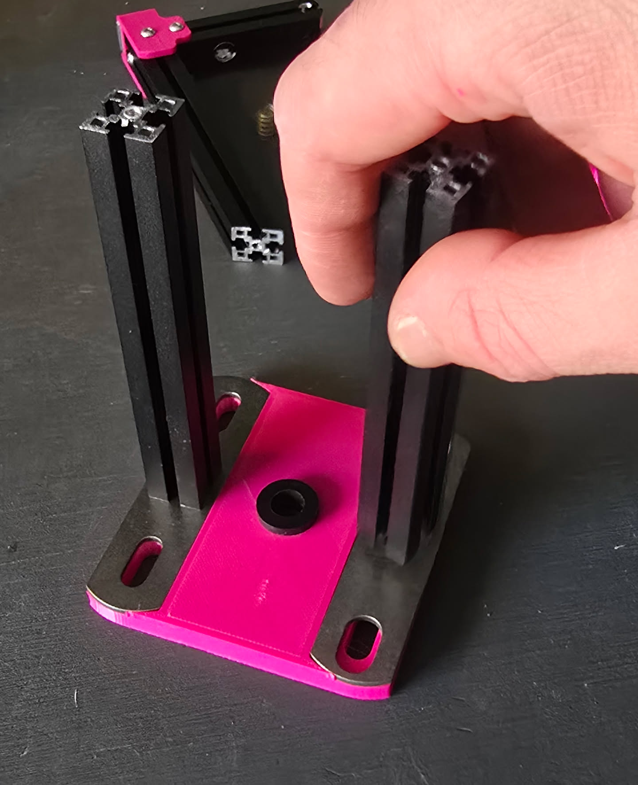 |
|:--:|
| *Threading a profile extrusion onto the base.* |

### 3.3 Nuts

Slide **3 × M3 square nuts** into each extrusion: **two** in the **bottom** T-slot and **one** in the **outside** T-slot.

| 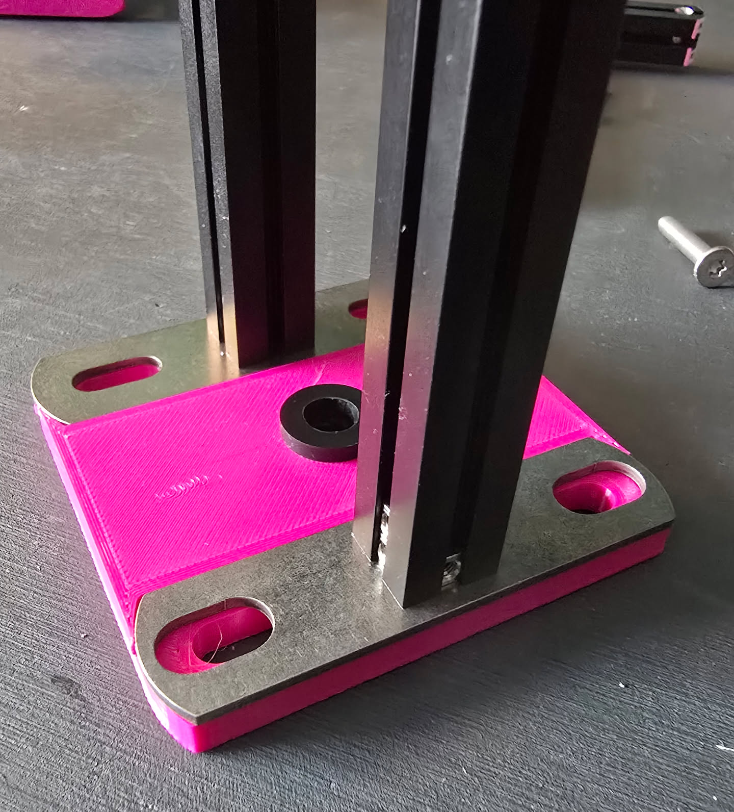 |
|:--:|
| *Square nuts slid into the bottom and outside T-slots of each extrusion.* |

### 3.4 Backstop

Screw the backstop onto the other end of each extrusion with the **2 × M3 × 12 mm** button head screws. You might need a washer so the screw holds the baffle in place.

| 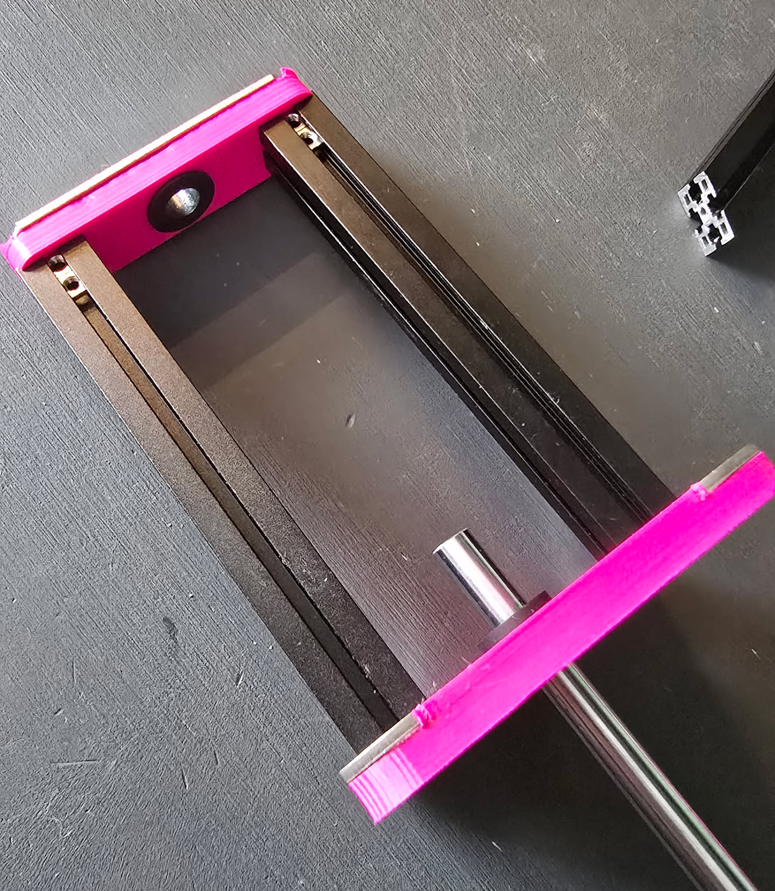 |
|:--:|
| *Backstop screwed onto the far ends of the profile extrusions.* |

## 4. Linear rod

| 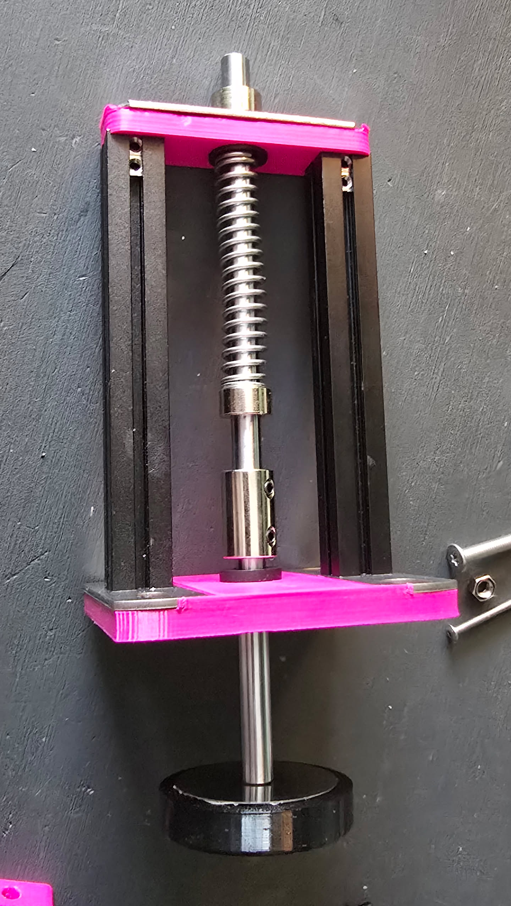 |
|:--:|
| *Completed linear rod: plunger, coupler, spring, and both shaft collars on the main body.* |

You will need:

- Plunger and linear rod from step 2
- Main body from step 3
- **8–8 mm** shaft coupler
- **2 ×** 8 mm shaft lock collars
- **70 mm** main compression spring
- **M4 × 3 mm** grub screws
- **2 ×** TPU washers (optional)

Slide the linear rod, **the end without the plunger**, into the main body through the base bushing (see the [backstop picture](#34-backstop) above).

Slide the **shaft coupler**, then a **shaft lock collar**, onto the linear rod.

| 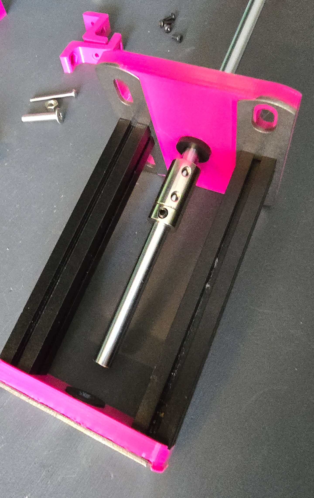 |
|:--:|
| *Shaft coupler and lock collar slid onto the linear rod.* |

Slide the **70 mm** main spring onto the linear rod, push the rod through the backstop bushing, and add the second **shaft lock collar** on the end past the backstop.

| 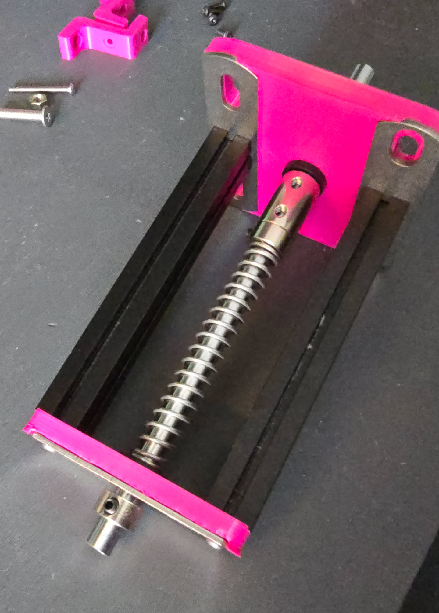 |
|:--:|
| *Main spring on the rod, second shaft collar past the backstop.* |

Optionally, slide a TPU washer between the shaft collar and the main spring, and another TPU washer between the backstop and the shaft collar. This dampens vibration a bit and makes the thrusters a lot quieter.

Add the short **4 × M4 × 3 mm** grub screws to the shaft coupler. The exact position of the two shaft collars and the shaft coupler does not matter much at this point. Tighten the grub screws **lightly** so things stay in place; do not tighten them all the way yet.

You should now have a complete linear rod. Press on the plunger: the spring should push it back.

Final positions are set when you tune the thruster. See [tuning.md](tuning.md).

## 5. Hammer assembly

| 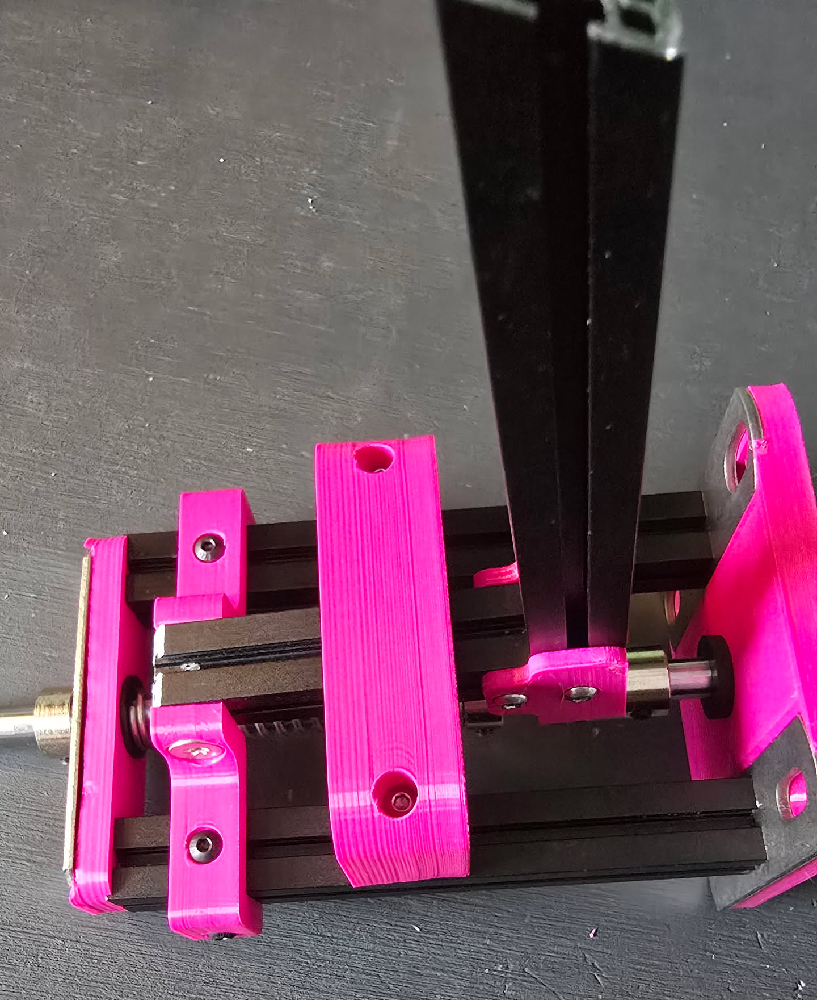 |
|:--:|
| *Completed hammer assembly: holders, pivot, spring, and spring holder on the main body.* |

You will need:

- Assembled hammer from step 1
- Main body and linear rod from steps 3–4
- Hammer holders (`hammer_holder.stl` and `hammer_holder_nut.stl`)
- Extra pair of hammer holders (optional, as a positioning guide)
- Spring holder (`spring_holder.stl`)
- **4 × M3 × 6 mm** button head screws
- **1 × M5** nut
- **1 × M5 × 25 mm** flat Torx screw
- **10 mm** hammer spring
- **2 × M3 × 30 mm** button head screws
- Threadlocker

### 5.1 Hammer holders

Line up the hammer holders about **10 mm** from the backstop. You can use an extra set of hammer holders as a guide.

| 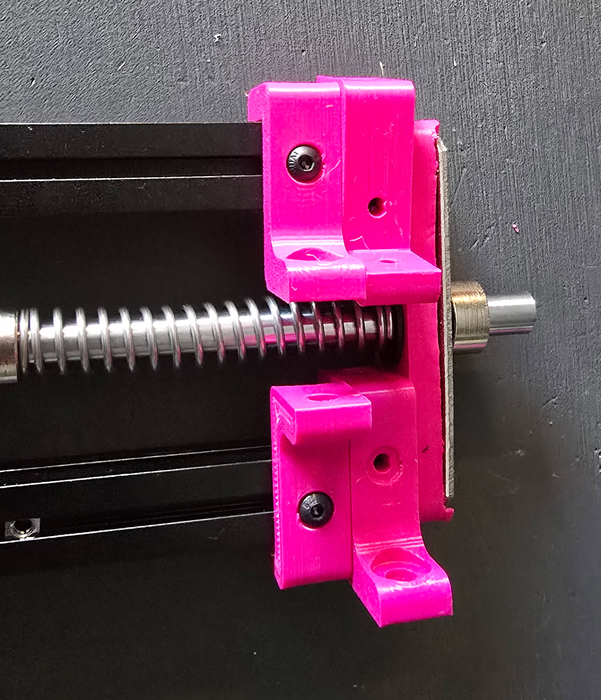 |
|:--:|
| *Hammer holders spaced ~10 mm from the backstop, using a spare pair as a guide.* |

Screw in **2 × M3 × 6 mm** button head screws in each hammer holder. They screw into the **M3 square nuts** that were previously slipped into the T-slots of the extrusions.

Slide the **M5 nut** into the nut side of the hammer holder. A **2.0 mm** socket screwdriver works well to push it in.

| 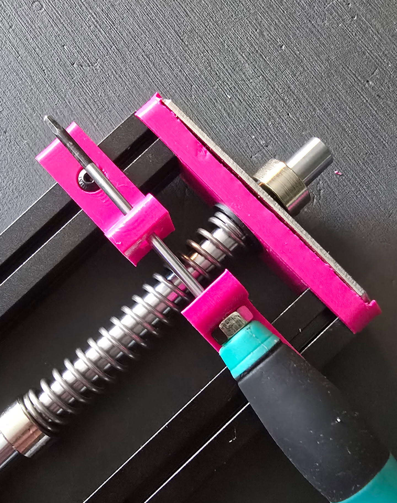 |
|:--:|
| *Pushing the M5 nut into the nut-side hammer holder.* |

Line up the end of the assembled hammer (the end with the hole in the top extrusion) between the two hammer holders.

Slide the **M5 × 25 mm** flat Torx screw in from the screw side of the hammer holder, through the assembled hammer, and turn it just until it starts gripping the nut threads.

| 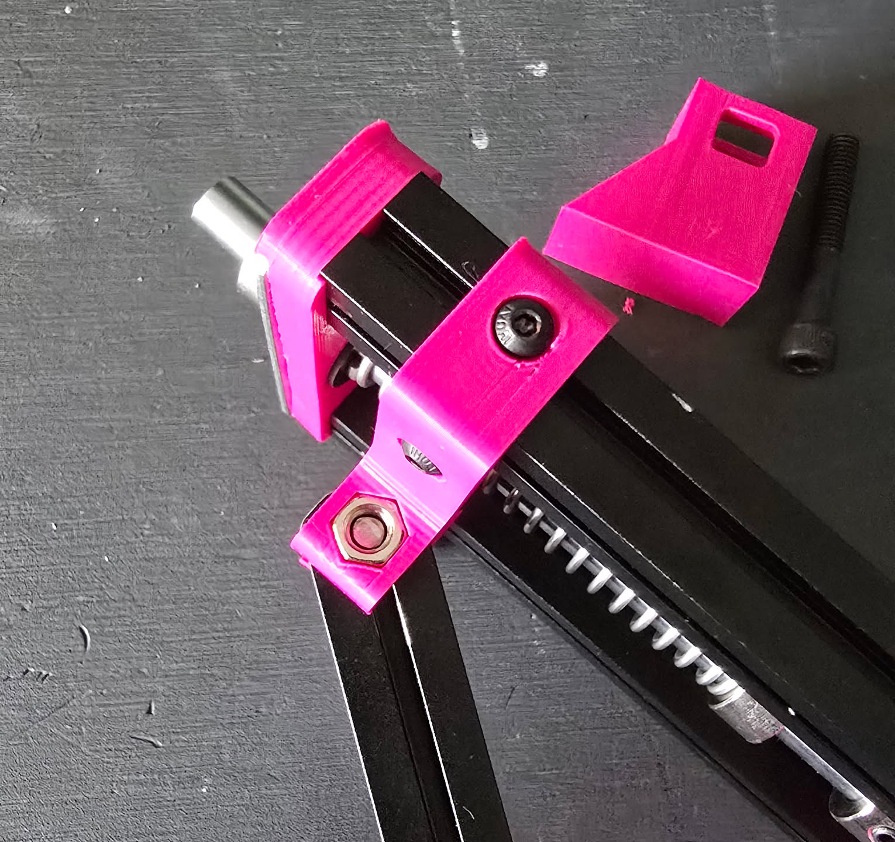 |
|:--:|
| *M5 pivot screw through the holders and hammer, just starting in the nut.* |

Drop a single drop of threadlocker in the nut and tighten the screw as tight as possible while still allowing the hammer to swing freely. There should be very little resistance.

| 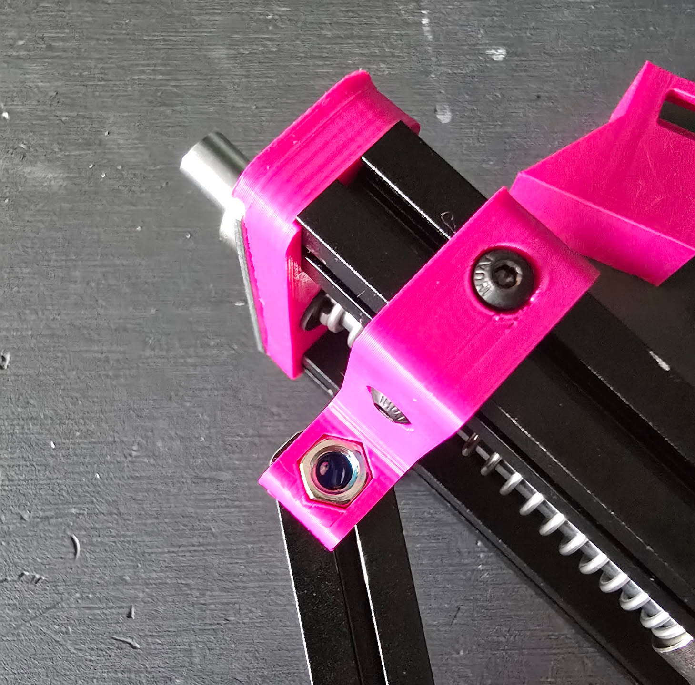 |
|:--:|
| *A drop of threadlocker in the M5 nut before final tightening.* |

### 5.2 Hammer spring

Drop the **10 mm** spring into the groove previously drilled in the hammer top extrusion.

| 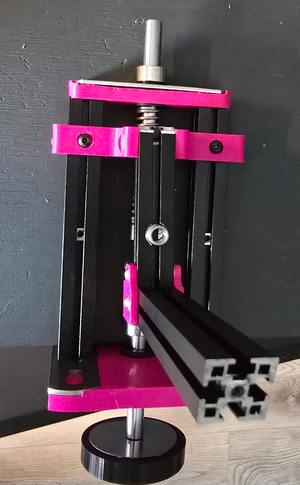 |
|:--:|
| *10 mm hammer spring seated in the groove of the top extrusion.* |

Line up the **M3 square nuts** for the `spring_holder.stl` part.

Put the spring holder on top of the spring. Use a screwdriver to make sure the nuts line up with the part’s holes.

Drop an **M3 × 30 mm** button head screw in each hole of the spring holder and screw it into the M3 square nuts.

## 6. Pedal connector (optional)

If you chose to use the pedal connector, slip the **M6 × 40 mm** screw into the pedal connector and put a nut on top.

| 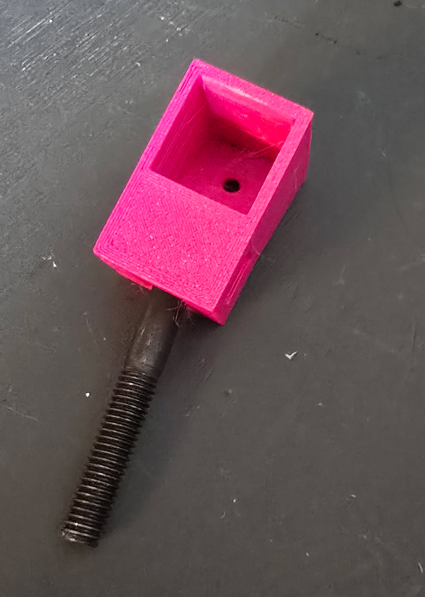 | 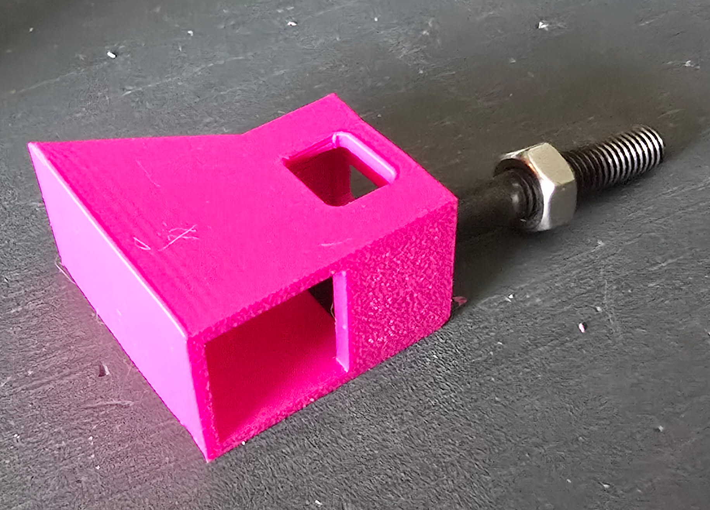 |
|:--:|:--:|
| *M6 × 40 mm screw slipped into the pedal connector.* | *Nut on the screw; use the rod coupling nut to connect to the pedal later.* |

Slide the pedal connector onto the end of the hammer and lock it in place with an **M3** screw.

Use the **rod coupling nut** to connect it to the pedal later.

## Mounting

| 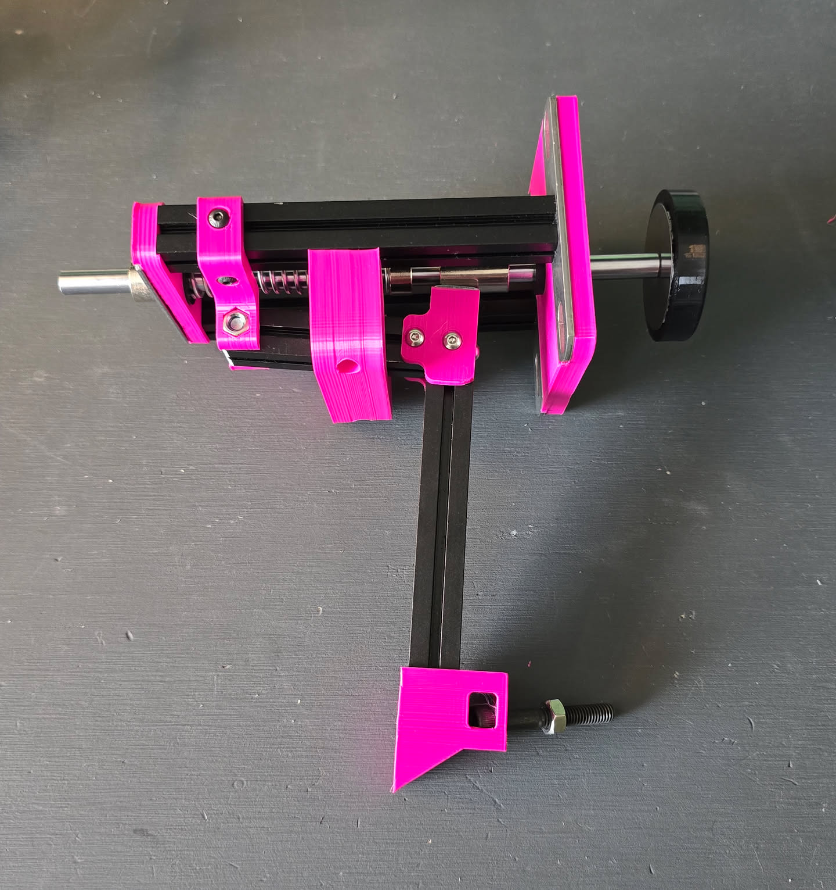 |
|:--:|
| *Assembled thruster, ready to mount.* |

The thruster is now assembled and ready to mount.

I will not provide full instructions for the box itself. This section only covers how the thruster attaches to the face of the box.

This is **not** an actual flyball box. The board in the photos is just a placeholder to show the mounting procedure. The **M6** screws used here are also not the correct screws: they should be **countersunk** so they do not leave bumps in the matting.

You need a **2"** hole in the box face for the plunger. A hole saw is the easiest way to cut it.

| 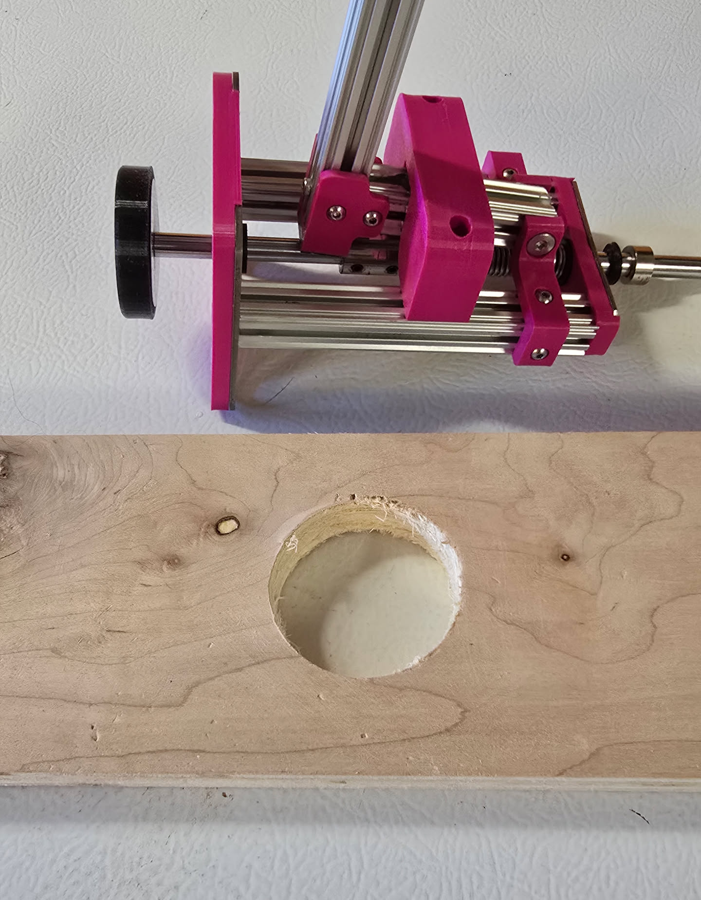 |
|:--:|
| *2" hole cut with a hole saw.* |

Drill **4 × 6.5 mm** holes, **56 mm × 60 mm** apart, around the 2" hole. Or simply cut the 2" hole, put the thruster in place, and mark the 6.5 mm holes from the thruster.

| 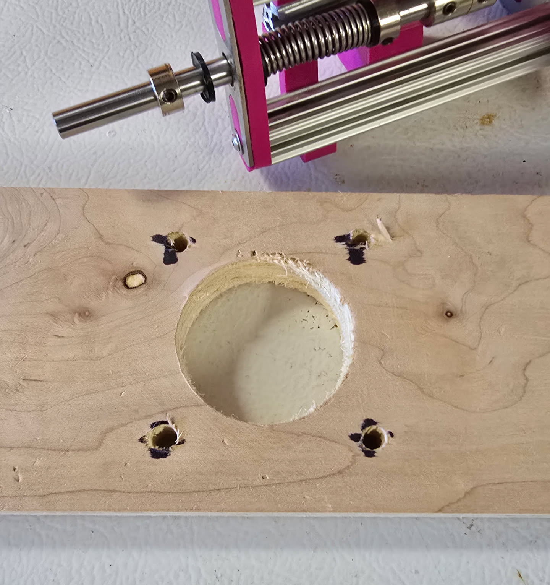 |
|:--:|
| *Four 6.5 mm holes marked and drilled around the 2" hole.* |

Mount the thruster with the **4 × M6 × 60 mm** screws and the **4 × M6 nuts**. The slots in the baffles and base let you shift the thruster a bit. Line the plunger up in the middle of the hole, then tighten the nuts.

| 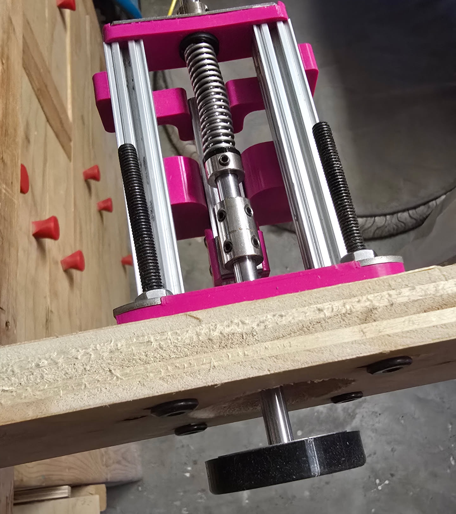 |
|:--:|
| *Thruster mounted with, what should be, M6 × 60 mm screws and M6 nuts.* |

The next step is to tune the thruster. See [tuning.md](tuning.md).
