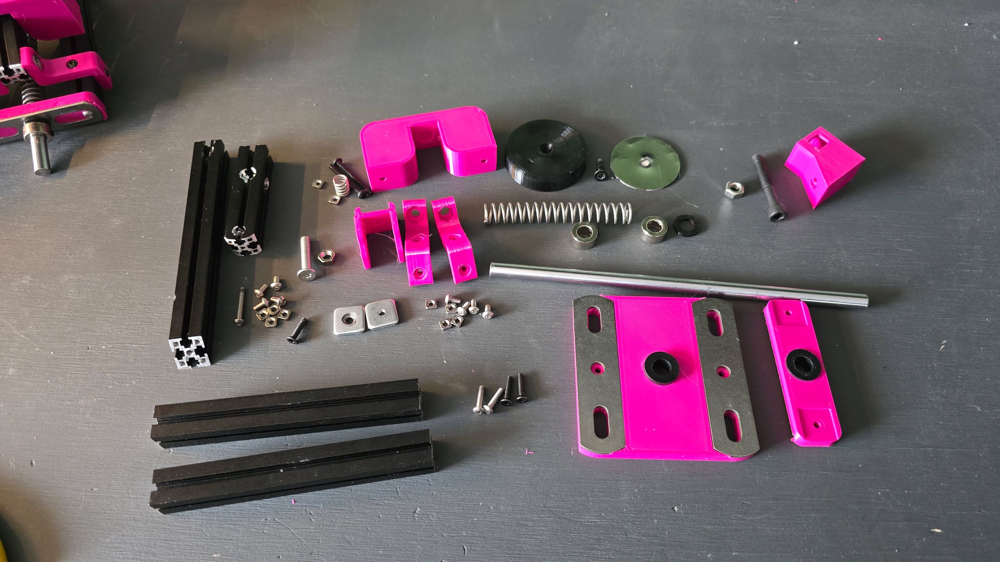

# Bill of Materials (BOM)

Per-thruster parts list. Multiply quantities by the number of thrusters you want to build.

Prices are approximate (CAD from original sources); expect ~\$40–45 CAD, or ~\$30 USD, per thruster depending on source and shipping.

Some parts are best bought in bulk, such as the aluminum extrusion and any fasteners.

| Qty | Item | Cost/unit | Total | Notes / link |
|-----|------|-----------|-------|--------------|
| | [Printed Parts – PETG](https://www.overture3d.ca/products/basic-petg-1-75mm-1-pack) | ~$2.49 | ~$2.49 | Print from STLs in `models/` |
| | [Printed Parts – TPU](https://www.overture3d.ca/products/tpu-1-75mm-1-pack) | ~$0.65 | ~$0.65 | |
| 2 | [1515 aluminum profiles × 115 mm](https://www.amazon.ca/dp/B06XJ42W51) (profile) | $3.34 [^1] | $6.68 | 15×15 mm extrusion for main profile |
| 1 | 1515 aluminum profiles × 65 mm (hammer) | $1.87 [^1] | $1.87 | Hammer top extrusion  |
| 1 | 1515 aluminum profiles × 135 mm (hammer) | $3.88 [^1] | $3.88 | Hammer side extrusion |
| 2 | [80×20×2 mm 304 stainless steel baffle](https://www.aliexpress.com/item/1005010219763652.html) | $1.16 | $2.32 | For the base. Optional, could be done without, but highly recommended due to strength it provides |
| 1 | [70×20×2 mm 304 stainless steel baffle](https://www.aliexpress.com/item/1005010628242895.html) | $4.00 | $4.00 | For the backstop. Optional, also could be done without, but highly recommended due to strength |
| 1 | [M4x15x15x3mm square nut](https://www.aliexpress.com/item/1005008724571592.html?spm=a2g0o.order_list.order_list_main.181.52d11802MeMOAG) | $0.25 | $0.25 | Technically optional, can be printed instead but highly recommended that you machine it |
| 1 | [8 mm OD × 200 mm linear shaft with M4 threaded holes](https://www.aliexpress.com/item/1005007982728863.html) | $9.54 | $9.54 | ~7" |
| 1 | [12 mm OD × 1.2 mm wire × 70 mm compression spring](https://www.aliexpress.com/item/1005005402569008.html) | $0.93 | $0.93 | Main spring |
| 1 | [8 mm OD × 0.9 mm wire × 10 mm compression spring](https://www.aliexpress.com/item/1005005402584700.html) | $0.33 | $0.33 | Hammer spring |
| 2 | [8 mm shaft lock collar (T8)](https://www.aliexpress.com/item/32830905214.html) | $0.52 | $1.05 | |
| 1 | [40×40 mm metal plate disk](https://www.aliexpress.com/item/1005008983416584.html) | $0.56 | $0.56 | |
| 1 | [8–8 mm shaft coupler](https://www.aliexpress.com/item/1005010151471423.html) | $1.64 | $1.64 | |
| 4 | [M4 × 3 mm grub screws](https://www.aliexpress.com/item/1005007184737120.html) | $0.14 | $0.55 | |
| 2 | [M8 T-shaped nylon washer/gasket](https://www.aliexpress.com/item/1005008152448252.html) | $0.20 | $0.40 | |
| 1 | [M4 × 14 mm countersunk Torx machine screws](https://www.aliexpress.com/item/4001255830388.html) | $0.12 | $0.12 | |
| 3 | [M3 × 14 mm countersunk Torx machine screws](https://www.aliexpress.com/item/4001255830388.html) | $0.08 | $0.24 | |
| 8 | [M3 × 6 mm button head machine screws](https://www.aliexpress.com/item/32967225441.html) | $0.05 | $0.43 | |
| 2 | [M3 × 10 mm button head machine screws](https://www.aliexpress.com/item/32967225441.html) | $0.06 | $0.13 | |
| 2 | [M3 × 12 mm button head machine screws](https://www.aliexpress.com/item/32967225441.html) | $0.07 | $0.13 | |
| 1 | [M3 × 25 mm socket head cap machine screws](https://www.aliexpress.com/item/32980100109.html) | $0.10 | $0.10 | |
| 2 | [M3 × 30 mm button head machine screws](https://www.aliexpress.com/item/32967225441.html) | $0.10 | $0.20 | |
| 10 | [M3 square nuts](https://www.aliexpress.com/item/1005009866787243.html) | $0.05 | $0.50 | To fasten parts on the 15x15 extrusion |
| 1 | [M5 × 25 mm flat Torx machine screws](https://www.aliexpress.com/item/1005002254557923.html) | $0.87 | $0.87 | Hammer/catcher pivot |
| 1 | [M5 nuts](https://www.aliexpress.com/item/1005007593861199.html) | $0.12 | $0.12 | Hammer/catcher pivot |
| 4 | [M6 × 60 mm machine screws](https://www.aliexpress.com/item/1005008846077891.html) | $0.59 | $2.38 | Used to mount to the box |
| 4 | [M6 nuts](https://www.aliexpress.com/item/1005007593861199.html) | $0.15 | $0.60 | Used to mount to the box |
| 1 | [M6 × 10 mm × 40 mm hex rod coupling nuts](https://www.aliexpress.com/item/1005006565508071.html) | $1.02 | $1.02 | Optional, pedal connector |
| 1 | [M6 × 40 mm partially threaded machine screws](https://www.aliexpress.com/item/32860422627.html) | $0.81 | $0.81 | Optional, pedal connector |
| 1 | [M6 × 20 mm flat head machine screws](https://www.aliexpress.com/item/1005008614137094.html) | $0.56 | $0.56 | Optional, pedal connector |
| | | | **~\$42.96** | Main list total (CAD) |
| | | | **+\$2.39** | With optional pedal connector (CAD) |

[^1]: **Aluminum extrusion unit cost:** Extrusion is bought in bulk (e.g. a pack of 4 × 1000 mm). The cost/unit shown is the **price per mm** (total pack price ÷ 4000 mm) × the length of that profile.

##  Notes

- **Printed parts:** Print all STLs in `models/` from the PETG and TPU allocations above (see [INSTRUCTIONS.md](INSTRUCTIONS.md) for print settings).
- **1515 profiles:** Often sold in multi-packs; one pack may cover several thrusters.
- **Sourcing:** Links are from the original BOM (Overture, Amazon.ca, AliExpress). You can substitute equivalent parts from local or preferred suppliers; confirm dimensions and thread specs (M3/M4/M5/M6) match.
- **Currency:** Original prices in CAD. USD equivalent is roughly 25–30% less depending on exchange rate.
