# Build Instructions

These instructions cover the **thrusters only**. They do not include any instructions for building a flyball box.

Follow these steps to get all parts ready for assembly. Then see [assembly.md](assembly.md) to put the thruster together.

- [Tools required](#tools-required)
- [1. Obtain parts from the BOM](#1-obtain-parts-from-the-bom)
- [2. Print the solid (PETG) parts](#2-print-the-solid-petg-parts)
- [3. Print the TPU parts](#3-print-the-tpu-parts)
- [4. Aluminum extrusions](#4-aluminum-extrusions)
  - [4.1 Profile extrusions](#41-profile-extrusions-2-pieces)
  - [4.2 Hammer top extrusion](#42-hammer-top-extrusion-1-piece)
  - [4.3 Hammer side extrusion](#43-hammer-side-extrusion-1-piece)
- [5. Hammer head](#5-hammer-head)
- [6. Plunger metal plate](#6-plunger-metal-plate)
- [7. Base and backstop gaskets](#7-base-and-backstop-gaskets)
  - [7.1 Ensure proper fit](#71-ensure-proper-fit-optional)
- [8. Backstop baffle](#8-backstop-baffle-optional-but-recommended)

|  |
|:--:|
| *Blowout view of all parts after this set of instructions and before assembly.* |

## Tools required

- M3 tap
- Drill (ideally a drill press for straight holes) and bits:
  - 3.2mm
  - 4mm
  - 5.5mm
  - 8mm
  - 9mm
- Something to cut aluminum extrusions
  - Mitre saw with a metal blade is a good solution
- Step drill bit (for enlarging the 70 mm baffle hole)
- Screw drivers for all the various screws
- Cutting oil
- Threadlocker

## 1. Obtain parts from the BOM

Gather all items from the [Bill of Materials (BOM.md)](BOM.md). Multiply quantities by the number of thrusters you are building. Order or source printed materials (PETG, TPU), aluminum profiles, hardware, and any optional items before starting.

## 2. Print the solid (PETG) parts

**Material:** PETG is highly recommended for the rigid printed parts.

- Slice the STLs with your favorite slicer.
- **Print orientation:** Recommended orientation for each part:
  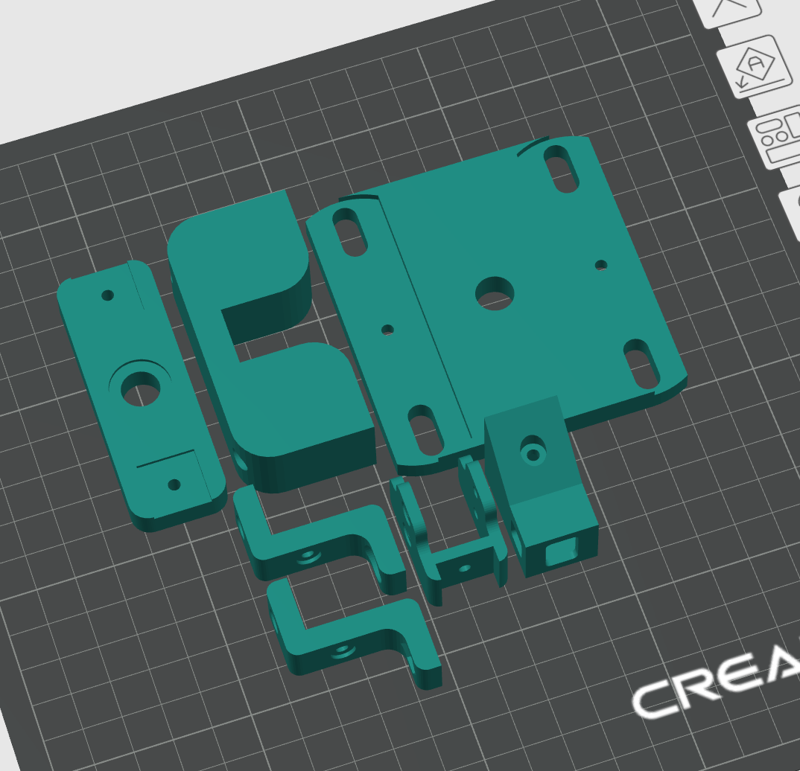
- **Supports:** Depending on your printer, no support should be required for any of the PETG parts.
- **Layer height:** 0.16 mm or 0.2 mm.
- **Infill:** Around 33%.
- **Walls:** For strong parts, use at least 5 walls (perimeters).

Print all rigid parts from the `parts/` folder that are intended for PETG:
- `backstop.stl`
- `base.stl`
- `hammer_head_nut.stl`
- `hammer_holder.stl`
- `spring_holder.stl`
- `pedal_connector.stl` (optional)
- `hammer_head.stl` (not recommended)

Optionally, you can print hammer head, but it's recommended that you use a metal part (see Step 5). PETG will wear out very quickly and it will require constant replacement.

## 3. Print the TPU parts

**Parts:** Plunger and, at least, one washer (or two).

- **Plunger:** Print with **100% infill** in TPU.
- **Washer:** The washer is thin and will likely slice with no infill. Ideally you could use two of these per thruster, they're used to dampen some of the vibration.
- **Skirt:** On my printer, I've had to set a minimum of 10 skirt layers to prevent a side of the plunger to lift from the bed.
- **Reference:** Orientation/layout:
  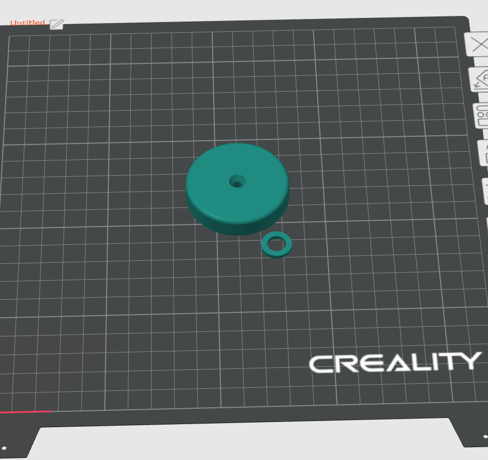

## 4. Aluminum extrusions

A total of **4 pieces** are needed: **two for the main profile** and **two for the hammer** (one hammer top, one hammer side).

The two main profile pieces must be cut **accurately, straight, and the same exact length**. A cheap way to do this is a **mitre saw with a metal blade**, aluminum cuts easily. Measure the length you need with a caliper, then clamp a piece of wood as a stop so you can butt the extrusion against it and repeat the same cut.

| 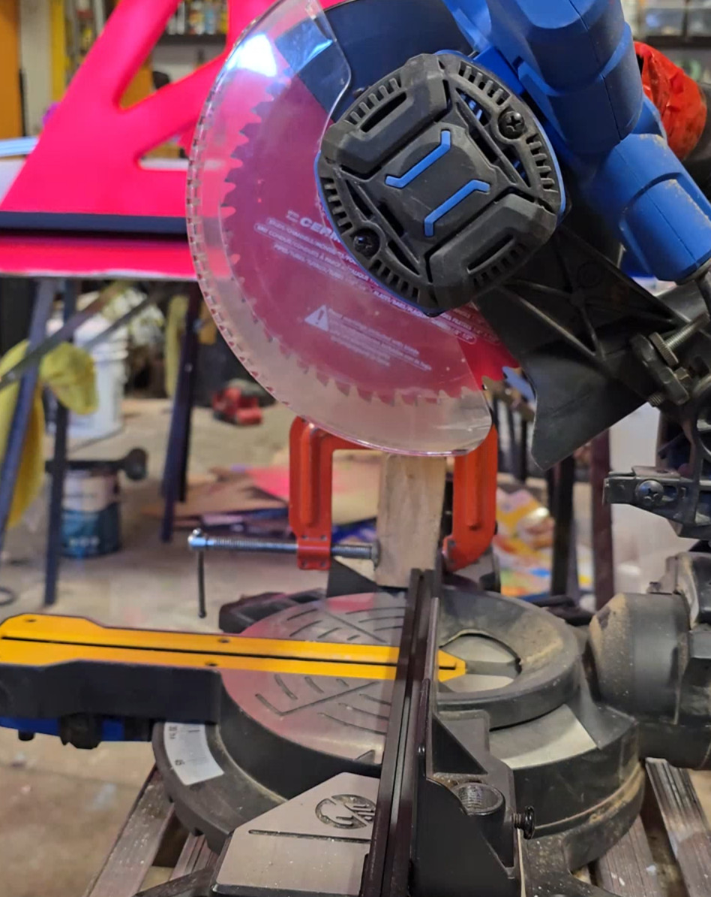 |
|:--:|
| *Aluminum extrusion (black) on mitre saw with 2×4 clamped 115 mm from the blade.* |

### 4.1 Profile extrusions (2 pieces)

- Cut **straight** to **115 mm** length; both pieces must be identical.
- Tap **M3 threads at both ends** of each piece.

| 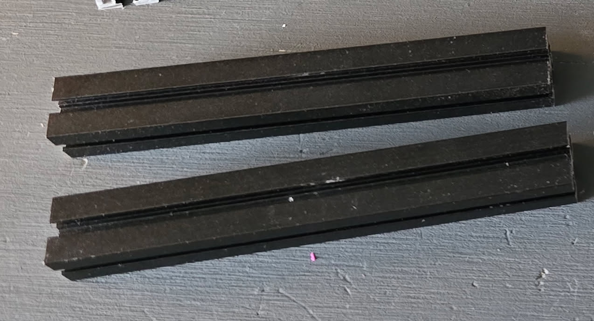 |
|:--:|
| *Two 115 mm profile extrusions, cut to the same length.* |

### 4.2 Hammer top extrusion (1 piece)

This part swivels and springs back the hammer.

- Cut to **65 mm**.
- **One end**, the end that will blind-joint to the hammer side extrusion, tap **M3 threads** (opposite end of the 5.5mm through hole).
- **5.5 mm through hole** at ~5 mm from the other end. This is for the M5 bolt that goes through both hammer holders.
- **9 mm groove** bored ~20 mm from the front. This is where the hammer spring sits.

| 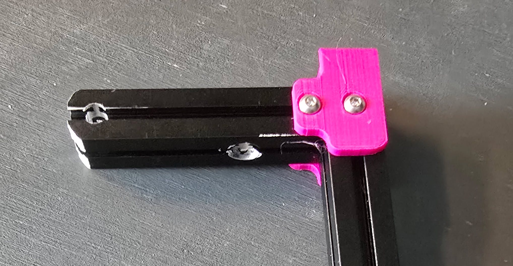 |
|:--:|
| *Hammer top extrusion, 65 mm long with 9 mm groove for the spring and 5.5 mm through hole.* |

### 4.3 Hammer side extrusion (1 piece)

- **Without pedal connector:** Cut **135 mm** long.
- **With pedal connector:** Cut at an angle so the **shorter side is 125 mm** and the **longer side is 135 mm**. Set the mitre blade to approximately **32.5°**.
- **3.2 mm through hole** at **11 mm from the top**.
- **Top hole:** tap **M3 threads**.
- **If using the pedal connector:** also tap the **bottom hole** with **M3 threads**.

## 5. Hammer head

The hammer head is *technically optional*, it *could* be printed (e.g. from PETG), but **machining it from steel is highly recommended**. A PETG hammer head will wear out quickly and require constant replacement.

Using the **M4 × 15 × 15 × 3 mm square nut** from the BOM, use a **larger drill bit to taper (countersink) the hole on one side** so the countersunk screw sits flush and does not stick out of the hammer head.

| 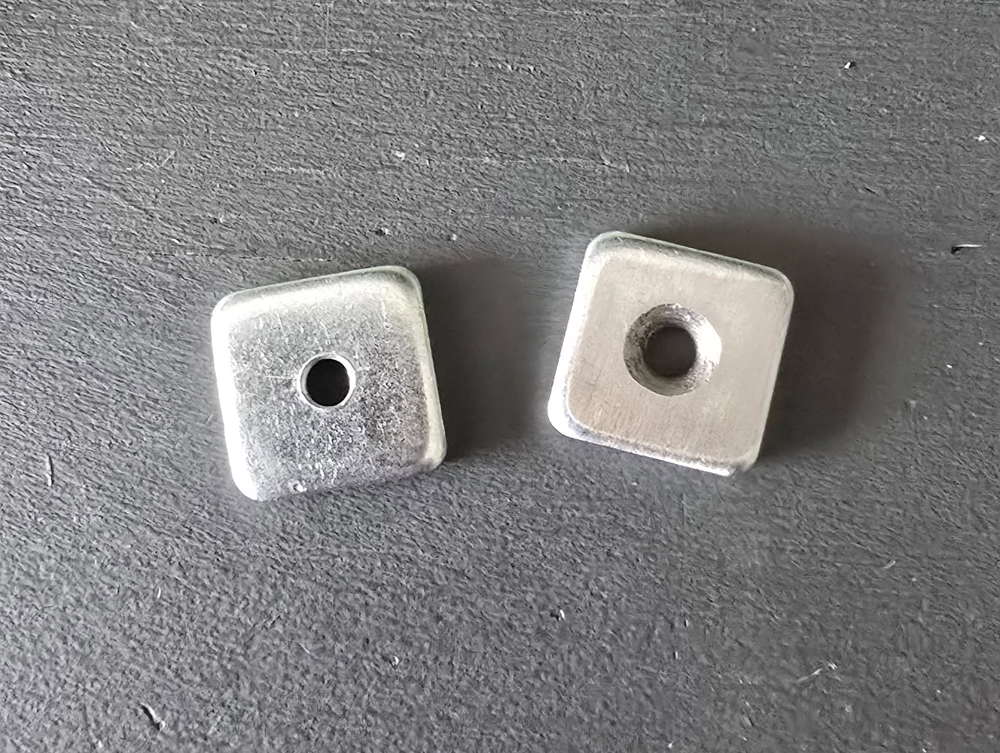 |
|:--:|
| *Machined square nut: bottom (left) and countersunk top (right).* |

## 6. Plunger metal plate

Using the **40×40 mm metal plate disk** from the BOM, drill a **4 mm hole in the middle** of the plate.

| 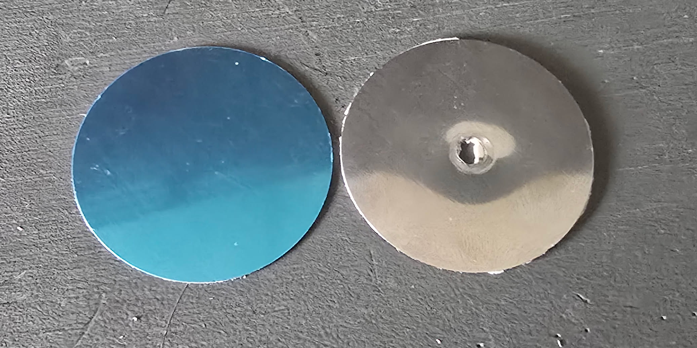 |
|:--:|
| *Stock plate (left) and drilled plunger plate (right).* |

## 7. Base and backstop gaskets

Add a drop of super glue, then snap-push an **M8 T-shaped nylon washer/gasket** into the `base.stl` part so it does not pop out.

| 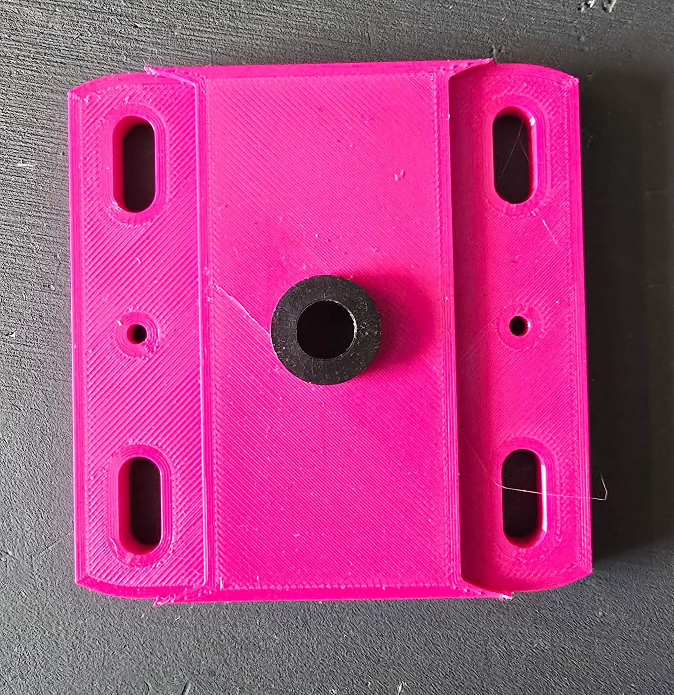 |
|:--:|
| *M8 T-shaped nylon gasket snap-pushed into the base.* |

Do the same for `backstop.stl`.

| 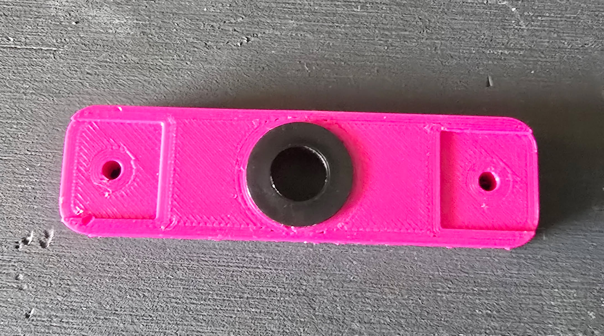 |
|:--:|
| *M8 T-shaped nylon gasket snap-pushed into the backstop.* |

### 7.1 Ensure proper fit (optional)

Take a linear rod and check that it can slide nicely through both gaskets. If there is resistance, drill the gasket back and forth with an **8 mm** bit until the linear rod can slide loosely.

| 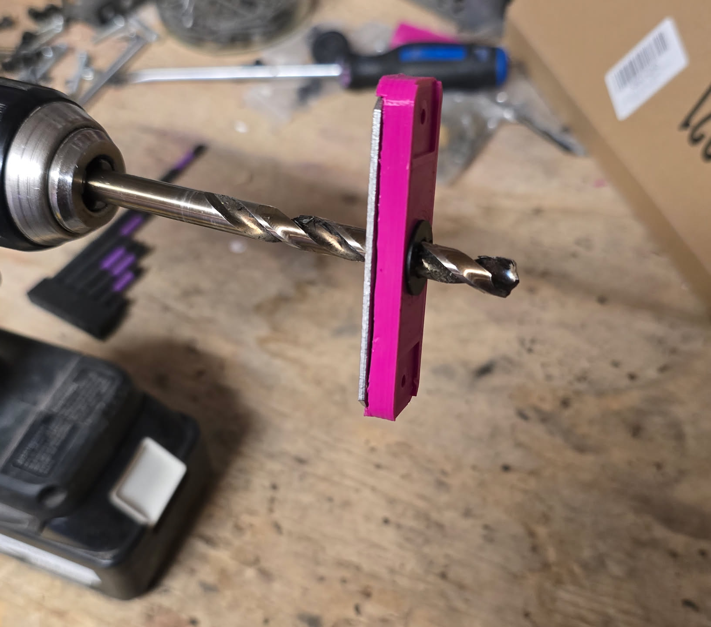 |
|:--:|
| *Opening up a gasket with an 8 mm bit so the linear rod slides freely.* |

## 8. Backstop baffle (optional, but recommended)

Using the **70×20×2 mm 304 stainless steel baffle** from the BOM, enlarge the **hole in the middle**. A **step drill bit** makes this easy.

| 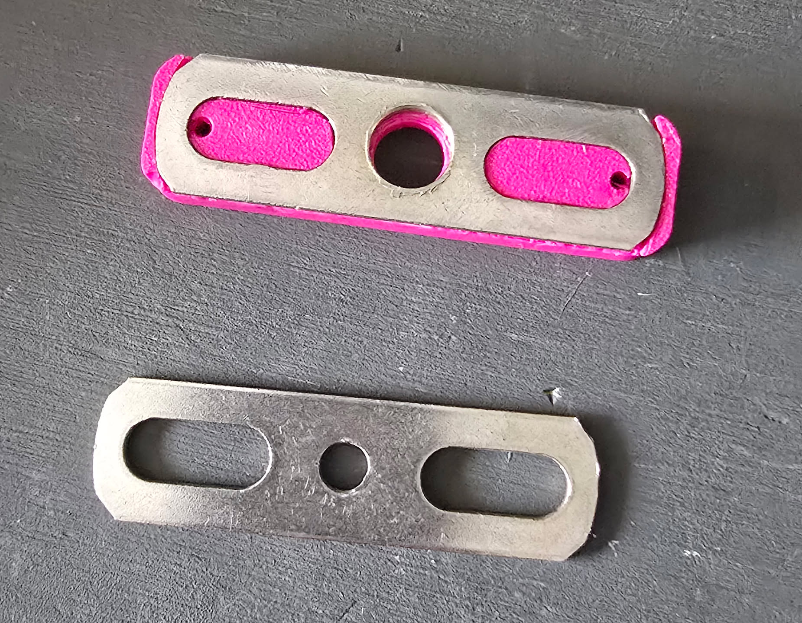 |
|:--:|
| *Enlarged center hole seated on the backstop (top) vs stock hole (bottom).* |

## Assembly

Once PETG and TPU parts are printed, extrusions, hammer head, plunger plate, gaskets, and optional baffle are machined, and all BOM items are on hand, continue to [assembly.md](assembly.md).
