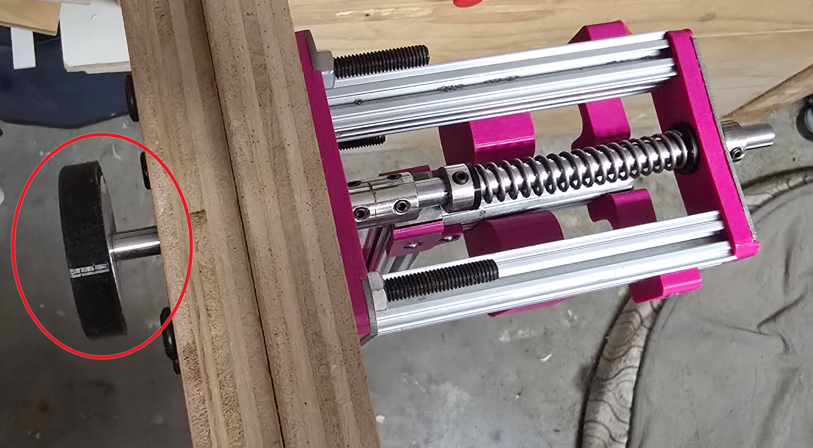
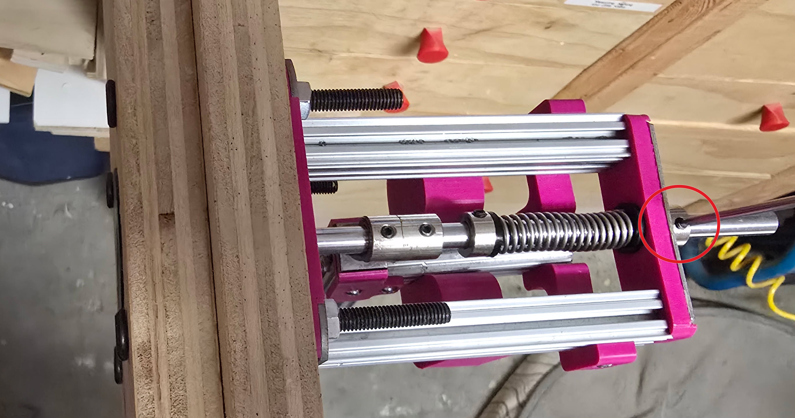
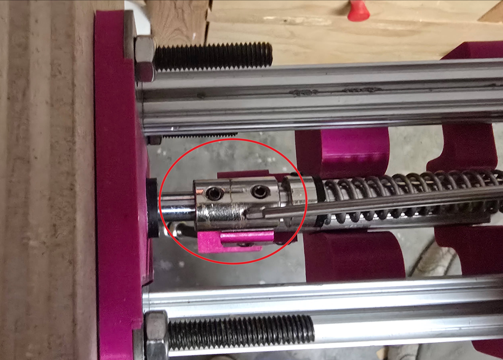
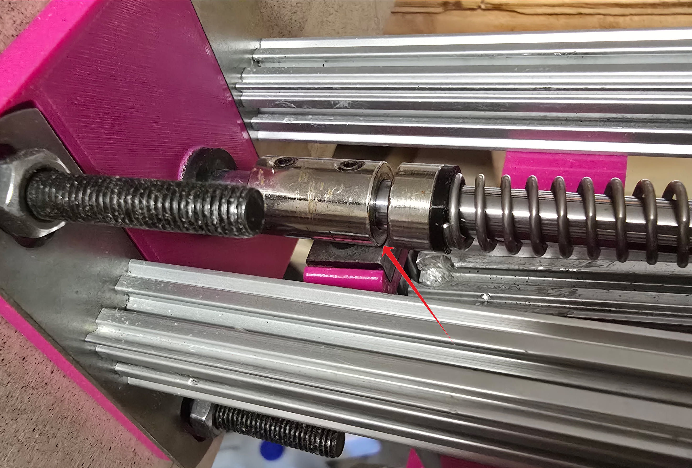
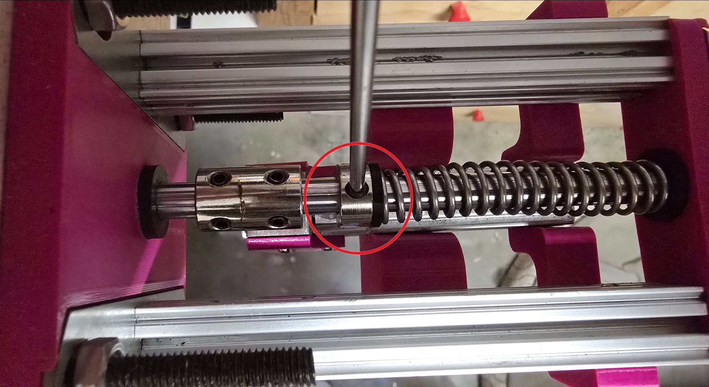
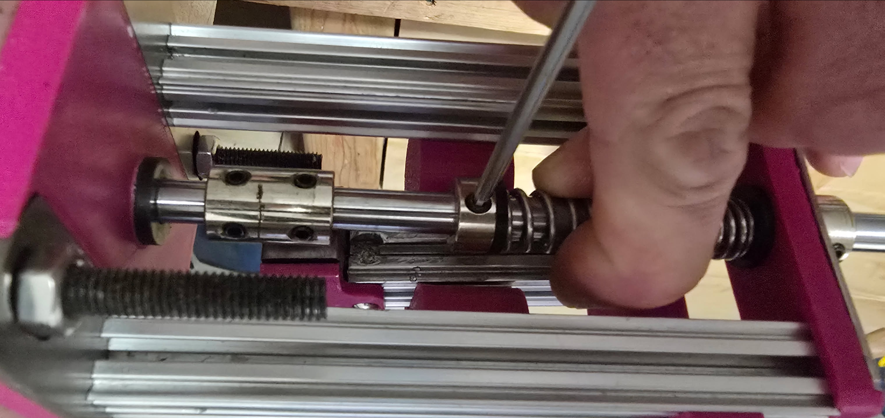

# Tuning

Set these in order. Adjust the **plunger position** before you adjust the **rest to loaded travel**.

- [Summary](#summary)
- [1. Plunger position](#1-plunger-position)
- [2. Rest to loaded travel](#2-rest-to-loaded-travel)
- [3. Ball throw distance](#3-ball-throw-distance)
  - [A note about throw distance](#a-note-about-throw-distance)

## Summary

| Adjustment | What it does | What you move |
|------------|--------------|---------------|
| [Plunger position](#1-plunger-position) | Rest position of the plunger relative to the faceplate | Rear collar |
| [Rest to loaded travel](#2-rest-to-loaded-travel) | How far back the plunger goes when you load the thruster | Shaft coupler |
| [Ball throw distance](#3-ball-throw-distance) | How far the thruster throws the ball | Spring preload (collar against the spring) |

## 1. Plunger position

This sets where the plunger rests compared to the faceplate of the box. Ideally, the plunger sits **flush with your matting**.

|  |
|:--:|
| *Plunger at rest, lined up with imaginary 3/4" matting.* |

Loosen the grub screw on the **rear collar**. Push the plunger back as far as you want it (use a piece of wood or something similar to keep it flush with the matting) and hold it there, then tighten the collar.

|  |
|:--:|
| *Rear collar: loosen the grub screw, set the plunger flush, then tighten.* |

The plunger should now rest in the right spot, flush with your matting.

Changing the plunger position means you also need to adjust the rest to loaded travel.

## 2. Rest to loaded travel

Changing the position of the **shaft coupler** changes how far back the plunger goes when you load the thruster.

|  |
|:--:|
| *Shaft coupler on the linear rod. Slide it to change loaded travel.* |

Sliding the shaft coupler toward the **front / base** makes the linear rod travel further when loading. It can also catch on the countersunk screw that holds the hammer head, which makes the thruster hard to load.

Sliding the shaft coupler too far toward the **spring** means the plunger does not go back far enough when you load, which can prevent balls from being loaded.

The ideal position is sitting just at the **edge of the hammer head** (the square nut at the top of the hammer). Set it there and tighten the grub screws.

|  |
|:--:|
| *Shaft coupler sitting just at the edge of the hammer head.* |

## 3. Ball throw distance

The collar sitting against the spring sets how much tension is in the main spring. That is how you tweak how hard the spring hits the ball, and how far the thruster throws it.

|  |
|:--:|
| *Collar against the spring. This is the preload adjustment.* |

Move the collar closer to the **shaft coupler** for less force / preload, and a shorter throw. Move it closer to the **backstop** for more force / preload, and a longer throw.

It is typically helpful to hold the spring back if you need to move the collar toward the backstop:

|  |
|:--:|
| *Hold the spring back so you can slide the collar toward the backstop.* |

In my experience, this does not need to be much more than **~10 mm** further than the shaft coupler. If you need a lot of spring preload, then there might be too much friction between your linear rod and your nylon bushings.

Lock the grub screw and test it.

### A note about throw distance

**Remember that you only need the thruster to throw the ball 24" (at least in NAFA).** I tend to aim for **~26–28"**. Throwing further than that gives a very negligible increase in speed. In a perfect box turn, the dog already has its mouth around the ball as it hits the pedal.

**Making it shoot further will only cause issues with softer dogs or dogs that catches the ball in the air, far from the faceplate.**

If you want to optimize the box for faster turns, **make the pedal more sensitive** so the thruster throws the ball as soon as you touch the pedal and not when it is fully depressed.